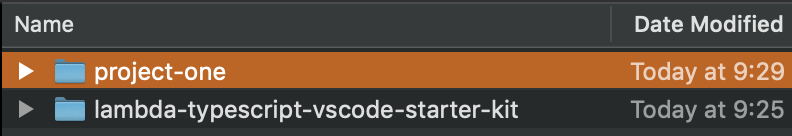
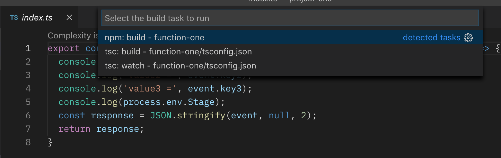
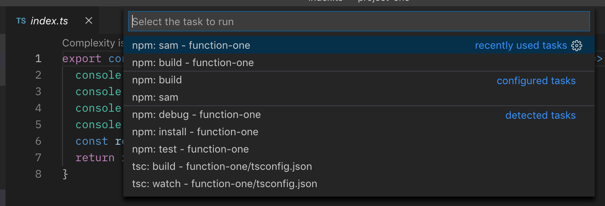
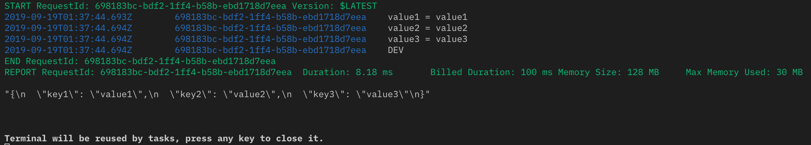

# Run Lambda in VSCode

## Open The Project

Open Visual Studio Code and open `project-one` folder.

## "Transpile" TypeScript

Press `Shift + Command + B` and select `npm: build - function-one`

This will run `tsc` to transpile all the typescript files under the folder.

## Run the Lambda Function

Press `shift + command + P` and select `Tasks: Run Task` and then select`npm: sam - function-one`

Final screenshot shows that we are able to run the lambda function from VSCode.

