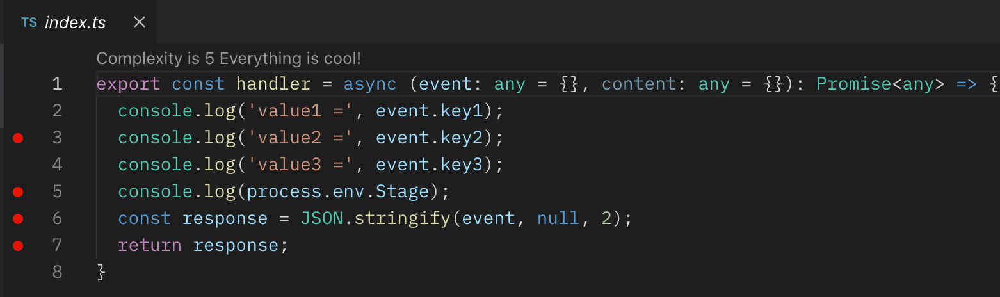
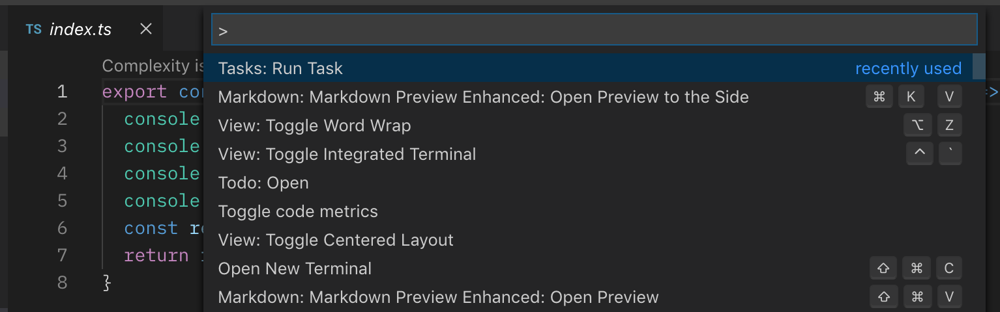
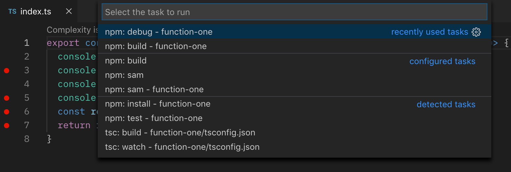
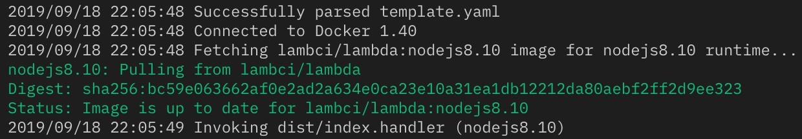
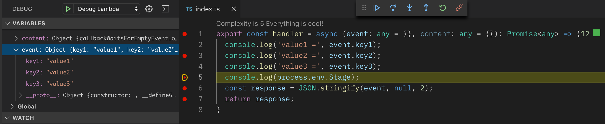

# Debug Lambda in VSCode

To debug a lambda function, first we need to set break points. Open `index.ts` file and click the space before the number line. You will see a red dot appear.

Press `shift + command + P` and select `Tasks: Run Task` and then select`npm: debug - function-one`

Below you can see the variable values during the run time.

